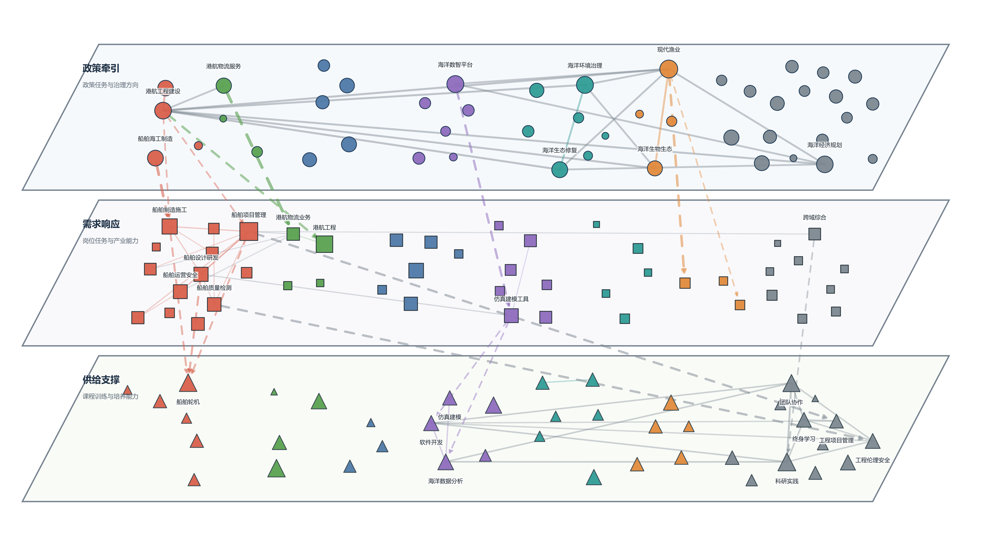

# 政策-需求-供给能力传导链说明

## 一、整幅图的含义

这幅图用来说明海洋人才能力体系中“政策牵引—需求响应—供给支撑”的传导关系。上层为政策端，表示政策文本中提出的产业方向、治理任务、工程项目和平台建设要求；中层为需求端，表示招聘岗位中体现的技术任务、工程交付、生产组织和管理能力；下层为供给端，表示高校培养方案、课程体系和实践训练中提供的能力支撑。

图中节点表示规范化后的中观能力，节点越大表示该能力在对应数据源中出现频次越高；节点颜色表示能力主题，包括船舶海工、港航交通、能源资源、数字智能、生态环境、水产生物和治理培养。层内实线表示同一端内部的能力共现关系，跨层虚线箭头表示上层能力任务向下层能力需求或能力供给的传导关系。整幅图的重点不是展示所有能力，而是识别政策、市场和培养体系之间是否形成了连续的能力链条。

## 二、层内连接如何确定

层内连接用于刻画同一数据源内部的能力组合关系。也就是说，政策端内部的线表示政策文本中哪些能力经常一起出现，需求端内部的线表示招聘岗位中哪些能力经常被同时要求，供给端内部的线表示培养方案或课程体系中哪些能力经常被共同训练。

具体处理规则如下：

- 政策端层内连接：若两个能力在同一政策文件中共同出现，则形成候选共现关系；共现强度由共同出现的政策文件数表示，即 `cooccurrence_policy_files`。
- 需求端层内连接：若两个能力在同一招聘来源单元中共同出现，则形成候选共现关系；共现强度由共同出现的来源单元数表示，即 `cooccurrence_source_units`。
- 供给端层内连接：若两个能力在同一培养方案、课程或来源单元中共同出现，则形成候选共现关系；共现强度同样由 `cooccurrence_source_units` 表示。
- 每条候选边同时计算 Jaccard 系数，用于衡量两个能力共现关系相对于各自出现范围的相对紧密程度。
- 图中只保留各端能力网络中的骨干边，即原始边表中 `in_backbone = yes` 的关系；在骨干边内部，再按共现强度和 Jaccard 系数排序，保留最核心的层内连接。

当前图中共保留层内实线 50 条，其中政策端 16 条，需求端 18 条，供给端 16 条。层内连接不表示因果关系，而表示同一端内部较稳定的能力组合。例如，若两个能力在多个政策文件或多个岗位中反复共同出现，说明它们构成了该端能力体系中的一个重要组合。

## 三、层间连接如何确定

层间连接用于识别“政策任务—岗位需求—培养供给”的能力传导关系。本文不把名称完全相同作为主要连接依据，因为政策文本、招聘文本和培养方案的表达方式不同，同一类能力往往会以不同名称出现。跨层连接强调的是功能承接关系，即上层提出的任务是否能够在下层找到相应的岗位需求或培养支撑。

跨层连接按以下步骤确定：

1. 只连接相邻层。政策端只连接需求端，需求端只连接供给端，不直接连接政策端和供给端。这样可以保留“政策先进入岗位需求，再由培养体系承接”的中介逻辑。
2. 生成候选关系。规则候选关系要求上下层节点属于同一能力主题，并且具有一定语义相近度。语义相近度由能力名称的词片段重合、主题一致性和频次信息共同构成；少量人工校准关系用于保留功能上明确承接、但主题短名可能不同的关系。
3. 计算节点重要性。节点重要性由出现频次、层内连接度和层内加权连接强度共同确定

4. 计算跨层连接优先级。跨层关系不是单纯按语义相似排序，而是更强调上下层节点本身是否重要

5. 控制图面复杂度。每组相邻层最多保留 8 条跨层关系，单个节点最多参与 3 条跨层关系，同一主题在同一层间最多保留 3 条关系。这样做是为了突出关键传导关系，而不是把所有可能关系都画出来。

当前图中共保留跨层虚线箭头 16 条，其中政策端到需求端 8 条，需求端到供给端 8 条。需要强调的是，虚线箭头表示“能力传导或承接”，不表示两个节点名称相同，也不表示已经存在严格因果关系。

## 四、从图中得到的主要结果

第一，政策、需求和供给之间并不是均匀贯通的关系，而是只在部分能力主题上形成较清晰的传导链。当前图中识别出 6 条三层贯通链条，即同一个需求端节点既承接了政策端任务，又继续连接到供给端能力。强度最高的贯通链条为：港航工程建设 -> 船舶项目管理 -> 船舶轮机。这说明船舶海工、港航工程和工程项目组织类能力在政策牵引、岗位需求和培养供给之间具有较强连续性。

第二，船舶海工相关链条最完整。政策端的“港航工程建设”和“船舶海工制造”能够向需求端的“船舶项目管理”“船舶制造施工”等节点传导，并进一步连接到供给端的“船舶轮机”“工程项目管理”等能力。这表明传统工程建设、船舶制造和项目管理类能力已经形成比较明确的政策—需求—供给承接路径。

第三，数字智能方向也形成了较清晰的传导链。政策端的“海洋数智平台”连接到需求端的“仿真建模工具”，并继续连接到供给端的“软件开发”和“海洋数据分析”。这表明海洋领域数字化平台建设正在转化为岗位中的工具使用、建模仿真和数据处理能力需求，培养端也已经提供一定的课程和训练支撑。

第四，部分政策需求尚未在供给端形成核心贯通。现代渔业、港航物流等政策或产业需求虽然能够连接到需求端，但在当前保留的核心跨层关系中没有继续向供给端贯通。这不表示供给端完全没有相关课程，而是说明在当前阈值和核心网络口径下，这些方向的培养支撑关系不如船舶海工和数字智能方向突出。

第五，部分供给能力能够支撑岗位需求，但其政策上游牵引在核心链条中不够明显。例如“科研实践”“工程伦理安全”“船舶轮机”等供给端能力与需求端存在连接，但其中部分关系没有在当前核心图中形成完整的政策端上游链条。这提示供给端存在一定的通用能力和专业基础能力，但这些能力与政策任务之间的显性对应关系仍有进一步强化空间。

## 五、三层贯通链条

下表列出当前图中能够从政策端连续传导到供给端的能力链条。这些链条可以理解为政策目标、岗位能力需求和高校培养供给之间相对完整的承接路径。

| 政策牵引 | 需求响应 | 供给支撑 | 政策-需求主题 | 需求-供给主题 | 链条强度 |
| --- | --- | --- | --- | --- | --- |
| 港航工程建设 | 船舶项目管理 | 船舶轮机 | 船舶海工 | 船舶海工 | 1.71 |
| 港航工程建设 | 船舶项目管理 | 工程项目管理 | 船舶海工 | 治理培养 | 1.70 |
| 港航工程建设 | 船舶制造施工 | 船舶轮机 | 船舶海工 | 船舶海工 | 1.31 |
| 海洋数智平台 | 仿真建模工具 | 软件开发 | 数字智能 | 数字智能 | 1.18 |
| 海洋数智平台 | 仿真建模工具 | 海洋数据分析 | 数字智能 | 数字智能 | 1.16 |
| 船舶海工制造 | 船舶制造施工 | 船舶轮机 | 船舶海工 | 船舶海工 | 1.13 |

## 六、未继续贯通的关系

### 已传导到需求端、但未继续连接到供给端

| 政策端节点 | 需求端节点 | 主题 | 连接优先级 |
| --- | --- | --- | --- |
| 港航工程建设 | 港航工程 | 港航交通 | 1.51 |
| 现代渔业 | 水产养殖 | 水产生物 | 1.18 |
| 现代渔业 | 海洋生物生态 | 水产生物 | 1.06 |
| 港航物流服务 | 港航物流业务 | 港航交通 | 1.05 |

### 已由供给端支撑、但缺少政策端上游连接

| 需求端节点 | 供给端节点 | 主题 | 连接优先级 |
| --- | --- | --- | --- |
| 跨域综合 | 科研实践 | 治理培养 | 1.26 |
| 船舶质量检测 | 工程伦理安全 | 治理培养 | 1.22 |
| 船舶设计研发 | 船舶轮机 | 船舶海工 | 1.15 |

## 七、跨层连接明细

### 政策端到需求端：政策任务向岗位能力需求转化

| 上层节点 | 下层节点 | 主题 | 上层重要性 | 下层重要性 | 优先级 |
| --- | --- | --- | --- | --- | --- |
| 港航工程建设 | 船舶项目管理 | 船舶海工 | 0.92 | 1.00 | 1.88 |
| 港航工程建设 | 港航工程 | 港航交通 | 0.92 | 0.54 | 1.51 |
| 港航工程建设 | 船舶制造施工 | 船舶海工 | 0.92 | 0.57 | 1.47 |
| 现代渔业 | 水产养殖 | 水产生物 | 0.94 | 0.17 | 1.18 |
| 海洋数智平台 | 仿真建模工具 | 数字智能 | 0.63 | 0.44 | 1.14 |
| 船舶海工制造 | 船舶制造施工 | 船舶海工 | 0.44 | 0.57 | 1.11 |
| 现代渔业 | 海洋生物生态 | 水产生物 | 0.94 | 0.13 | 1.06 |
| 港航物流服务 | 港航物流业务 | 港航交通 | 0.47 | 0.46 | 1.05 |

### 需求端到供给端：岗位能力需求向培养训练体系承接

| 上层节点 | 下层节点 | 主题 | 上层重要性 | 下层重要性 | 优先级 |
| --- | --- | --- | --- | --- | --- |
| 船舶项目管理 | 船舶轮机 | 船舶海工 | 1.00 | 0.56 | 1.55 |
| 船舶项目管理 | 工程项目管理 | 治理培养 | 1.00 | 0.48 | 1.52 |
| 跨域综合 | 科研实践 | 治理培养 | 0.27 | 1.00 | 1.26 |
| 船舶质量检测 | 工程伦理安全 | 治理培养 | 0.46 | 0.70 | 1.22 |
| 仿真建模工具 | 软件开发 | 数字智能 | 0.44 | 0.79 | 1.21 |
| 仿真建模工具 | 海洋数据分析 | 数字智能 | 0.44 | 0.75 | 1.18 |
| 船舶设计研发 | 船舶轮机 | 船舶海工 | 0.57 | 0.56 | 1.15 |
| 船舶制造施工 | 船舶轮机 | 船舶海工 | 0.57 | 0.56 | 1.14 |

## 八、可用于论文的表述

本文构建了政策端、需求端和供给端三层能力传导网络，用以分析海洋人才能力体系中政策牵引、产业需求和培养供给之间的衔接关系。层内连接依据同一数据源内部的能力共现关系确定，用于刻画政策文本、招聘岗位和培养方案各自内部的能力组合结构；层间连接依据主题一致性、语义相近性、节点出现频次和层内网络地位共同确定，用于识别政策任务向岗位需求、岗位需求向培养供给的潜在传导路径。结果显示，船舶海工和数字智能方向形成了较清晰的政策—需求—供给贯通链条，而现代渔业、港航物流等方向在当前核心网络中更多停留在政策—需求层面，提示部分政策导向与培养供给之间仍存在结构性衔接不足。

## 九、建议图注

图 X 政策端、需求端与供给端的海洋人才能力传导链。上、中、下三层分别表示政策牵引、产业需求响应和人才供给支撑。节点表示规范化后的中观能力，节点大小表示能力出现频次，节点颜色表示能力主题。层内实线表示同一数据源内部基于共现关系识别出的能力组合，跨层虚线箭头表示基于主题一致性、语义相近性和节点重要性识别出的能力传导关系。虚线箭头不代表能力名称完全一致，而表示政策任务、岗位需求与培养能力之间的潜在承接路径。
