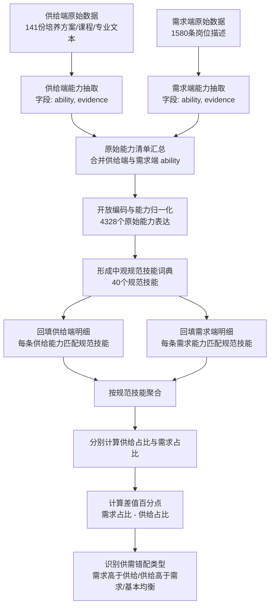

# 海洋人才供需能力匹配研究方法说明

## 一、研究目标

本研究要解决的问题是：海洋相关人才培养供给端与岗位需求端在能力结构上是否匹配，以及哪些能力存在相对短缺或相对富余。

供给端来自 141 份培养方案、课程体系或专业建设文本；需求端来自 1580 条海洋相关岗位描述。两类文本来源、表达方式和颗粒度差异很大，不能直接逐词比较。因此，本研究先从两端文本中抽取能力，再将能力归一化为统一的中观规范技能，最后在规范技能层面进行百分比匹配分析。

## 二、研究解决了什么问题

### 1. 解决文本来源异质问题

供给端文本通常使用培养目标、课程体系、毕业要求等表述，强调基础知识、科研训练、综合素养和专业能力。

需求端文本通常使用岗位职责、任职要求、项目经验等表述，强调具体工程任务、岗位技能、设备系统、项目管理和现场经验。

如果直接比较原始文本，两端语言体系不同，难以判断真实供需关系。本研究通过能力抽取和规范技能归一化，将两端文本转化为可比较的数据结构。

### 2. 解决能力名称不一致问题

同一类能力在原始文本中可能有很多表达方式。例如：

- 船舶电气设计能力
- 船舶电气调试能力
- 船舶电气质量检验能力
- 船舶电气自动化控制能力

这些不应被看作完全不同的能力，而应归并为中观层面的 `船舶电气自动化能力`。本研究通过开放编码，将 4328 个原始能力表达归并为 40 个规范技能。

### 3. 解决颗粒度过细或过粗问题

如果颗粒度过细，会产生数百个技能，难以形成论文主分析；如果颗粒度过粗，例如全部合并为“海洋工程能力”，又会丢失供需错配的具体方向。

本研究采用中观边界强化口径：保留船舶、海工、海上风电、港航物流、海洋科学、水产渔业、邻近工程支撑等边界，同时将低频长尾能力上收到可解释的能力模块，并对相近类别进行命名区分和边界校正。

最终形成 40 个规范技能，既能支撑统计比较，也能保留专业解释力。

### 4. 解决供需绝对数量不可比问题

供给端和需求端能力条目数量不同：

- 供给端能力条目：2711 条
- 需求端能力条目：2514 条

因此，本研究不直接使用绝对数量判断供需差异，而是分别计算两端内部百分比：

`供给占比 = 某规范技能供给端条目数 / 供给端全部能力条目数`

`需求占比 = 某规范技能需求端条目数 / 需求端全部能力条目数`

`差值百分点 = 需求占比 - 供给占比`

正值表示需求端相对更强调该能力，负值表示供给端相对更强调该能力。

## 三、整体技术流程

## 四、数据对齐逻辑

本研究的数据对齐不是按照原始词语直接匹配，而是按照“规范技能”进行匹配。

例如，供给端可能出现：

- 船舶电气工程能力
- 船舶电气系统设计能力
- 船舶电气自动化控制能力

需求端可能出现：

- 船舶电气调试能力
- 船舶电气设备维护能力
- 船舶电气质量检验能力

这些原始能力表述不同，但都指向同一类中观能力模块，因此统一归入：

`船舶电气自动化能力`

这样，供给端和需求端就可以在同一规范技能下进行比较。

对齐后的基本结构如下：

| 原始能力 | 来源端 | 规范技能 | 用途 |
|---|---|---|---|
| 船舶电气系统设计能力 | 供给端 | 船舶电气自动化能力 | 供给端能力统计 |
| 船舶电气调试能力 | 需求端 | 船舶电气自动化能力 | 需求端能力统计 |
| 海上风电施工管理能力 | 需求端 | 海洋能源与海上风电工程能力 | 需求端能力统计 |
| 海洋观测能力 | 供给端 | 海洋调查观测测绘能力 | 供给端能力统计 |

## 五、形成的核心数据文件

### 1. 能力归一化结果

目录：`供需能力开放编码_中观边界强化口径_全量/`

主要文件：

- `ability_open_coding_mapping.csv`：4328 个原始能力到 40 个规范技能的映射表
- `canonical_competency_dictionary.csv`：40 个规范技能词典及供需出现情况
- `supply_competency_items_coded.csv`：供给端能力明细及其规范技能
- `demand_competency_items_coded.csv`：需求端能力明细及其规范技能

### 2. 供需匹配结果

目录：`供需匹配分析_规范技能百分比_中观边界强化/`

主要文件：

- `competency_supply_demand_pct_match.csv`：40 个规范技能的供需百分比匹配总表
- `top_demand_gap_pct.csv`：需求端相对高于供给的能力
- `top_supply_excess_pct.csv`：供给端相对高于需求的能力
- `balanced_competencies_pct.csv`：供需相对均衡能力
- `supply_demand_pct_match_summary.md`：供需匹配摘要

## 六、初步匹配结果

### 1. 需求端相对高于供给的能力

需求端明显更高的能力主要集中在岗位化、工程化和产业应用导向能力：

| 规范技能 | 供给占比 | 需求占比 | 差值百分点 |
|---|---:|---:|---:|
| 船舶建造制造与质量能力 | 1.00% | 15.75% | +14.76 |
| 海洋能源与海上风电工程能力 | 1.07% | 9.11% | +8.04 |
| 海洋工程项目建设管理能力 | 0.26% | 5.97% | +5.71 |
| 港口航道水运工程能力 | 2.29% | 7.48% | +5.19 |
| 船舶电气自动化能力 | 1.92% | 6.92% | +5.00 |

这说明岗位需求更强调船舶制造、海上风电、海洋工程项目建设、港航水运工程和船舶电气自动化等产业实践能力。

### 2. 供给端相对高于需求的能力

供给端明显更高的能力主要集中在基础训练、科研实践、通用支撑和综合素养：

| 规范技能 | 供给占比 | 需求占比 | 差值百分点 |
|---|---:|---:|---:|
| 科研实验创新实践能力 | 8.00% | 0.28% | -7.73 |
| 数字化工具与软件应用能力 | 7.89% | 1.07% | -6.82 |
| 电子通信与自动控制能力 | 5.90% | 0.84% | -5.07 |
| 团队沟通国际化能力 | 6.16% | 1.63% | -4.53 |
| 航海驾驶与通导操作能力 | 3.95% | 0.20% | -3.75 |

这说明培养端更强调基础能力、科研训练、数字化工具、电子通信与自动控制、通用素养和航海驾驶基础，但这些能力在岗位描述中并没有以同等比例出现。

## 七、可以形成的汇报结论

本研究建立了一个从文本到能力、从能力到规范技能、从规范技能到供需匹配的分析流程。

主要结论可以概括为：

1. 海洋人才供需并非简单数量不足，而是能力结构存在错配。
2. 需求端更强调产业岗位直接需要的工程实践能力，尤其是船舶建造制造、海上风电、海洋工程项目建设、港航水运工程、船舶电气自动化和船舶市场商务。
3. 供给端更强调培养体系中的基础性、通用性和科研性能力，例如科研实验、数字化工具、电子通信与自动控制、团队沟通和工程基础。
4. 两端错配的核心表现是：培养端偏“基础与综合培养逻辑”，需求端偏“岗位与工程应用逻辑”。
5. 后续可以围绕需求高于供给的能力模块，提出专业课程调整、实践教学强化、校企协同培养和岗位能力模块嵌入等建议。

## 八、方法价值

该方法的价值在于：

- 将非结构化文本转化为可统计分析的能力数据。
- 避免直接用原词匹配造成的漏配和误配。
- 通过中观规范技能实现供需两端对齐。
- 使用百分比口径减少两端样本规模差异的影响。
- 能够为论文中的供需错配分析、能力结构诊断和培养优化建议提供数据支撑。
